# Instructions for Semi-automated HR Quantification

The following document will provide a step-by-step guide to the collection of quantitative HR data from agroinfiltrated leaves. The pipeline is currently suitable for both _Nicotiana benthamiana_ and lettuce (_Lactuca sativa_) leaves, but will be adapted for additional species in future.

For instructions regarding the preparation of _Agrobacterium tumefaciens_ cultures and carrying out agroinfiltration, please refer to the "Agroinfiltration Protocol.docx" document.

## Stage 0: Collection of fluorescence images

Use the ImageQuant 800 to collect fluorescence images of agroinfiltrated leaves. The ImageQuant imager can be found on the far right-hand corner of the main lab (CSF-02). 

.")

When turned on, the ImageQuant 800 software should boot automatically. Once loaded, the home screen menu will be displayed. To image leaves, select the "Fluorescence" option.

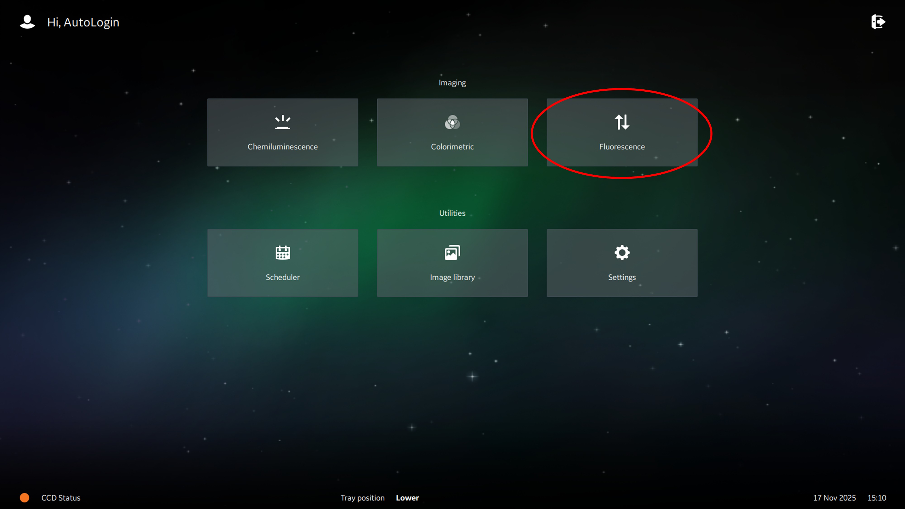

To select the imaging programme of choice, using the "Open method" button in the top left of the screen. This will provide a number of method options, each with a different selection of channels, or "Dyes".
The "benthi_leaves" or "LD LEAVES" settings are normally used for _N. benthamiana_ leaves, whilst "Lettuce_leaves" is available for imaging lettuce. A setting including the Cy3 and/or IRlong channels is recommended, as these provide the best contrast of cell death to background leaf. 

> **_NOTE:_**  If using the “Lettuce_leaves” setting, image collection time is ~3 minutes. 

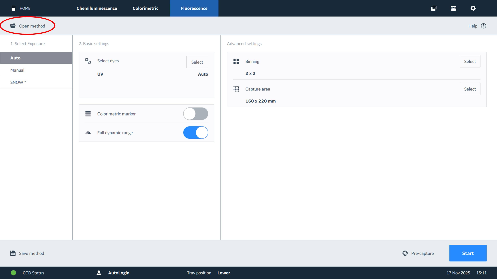

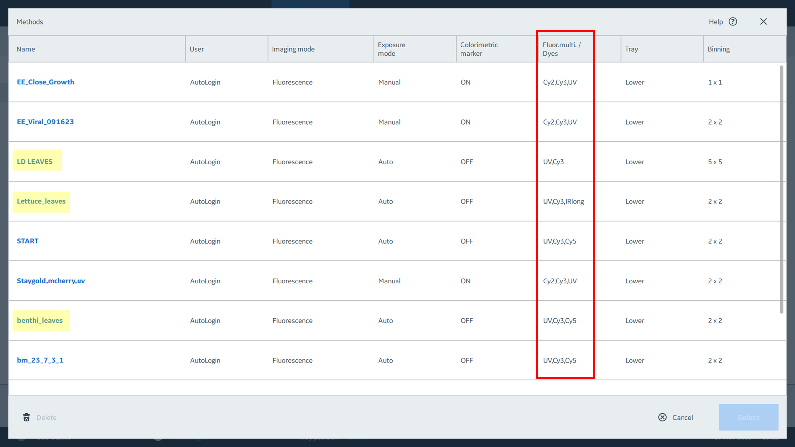

Add the first leaf to be imaged into the imager. The imaging tray should be placed in the lower position, at the bottom of the imager. If the tray is in the incorrect position, the programme will prompt the user to move it. Open the front of the imager and place the leaf in the centre of the imaging tray. Although multiple leaves may be imaged at one time, this may affect downstream quantification results and is not recommended.

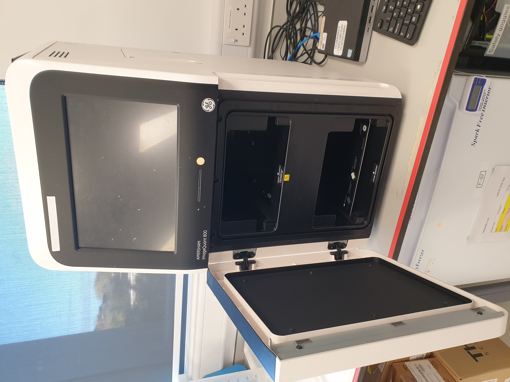

> **_NOTE:_**  For some plant species, it may be prefereable to image the underside ("abaxial" side) of the leaf. If this is the case, the leaf images may be later horizontally inverted, to standardise the positioning of the leaf patches. See "Flip images of leaf abaxial sides" for further details.

Once the imaging method has been selected and the leaf positioned, close the imager and click "Start" in the bottom-right to begin imaging.

Upon completion of imaging, an artificially coloured image of the leaf will be visible on screen. Select "Save" in the bottom right of the screen.
- Give the image an appropriate name "prefix". See below for the naming convention required to automatically add treatment metadata to output tables using this pipeline.
- Save the image in an appopriate folder in the "S:" drive. This folder is linked to the IFS network, and so may be accessed from other University machines for safe transfer of files.
- Deselect the "highlight saturated pixels" option, if on. This will ensure that artifically coloured images are of presentation quality.

### Formatting for saving image files

When saving images, please use the following file naming format. This will allow for the addition of treatment metadata to the HR quantification data later in the pipeline:
```
TLT_PT1,PT2,PT3,PT4,PT5_L1
```
TLT  is the “top-level treatment”, or treatment applied to each patch on the whole leaf. PT1 is patch treatment #1; the patch at the top-left of the leaf. L1 is leaf number 1. This layout is assigned based on viewing the adaxial side of the leaf (the top side, or the side facing the apical meristem). This is standardised, to prevent confusion at later stages. If images of the underside of the leaf have been taken, these may be inverted to match the leaf image to the projected treatment layout. See "Flip images of leaf abaxial sides" below, for further details.


 
> **_NOTE:_**  Both the ImageQuant software (and Windows more generally) have strict character limits for file and path names. Therefore using concise names where possible is recommended. As an example, the following leaf would be saved as “LsNRC0_EV,041-DV,601-DV,301-DV,800-DV_L1”:

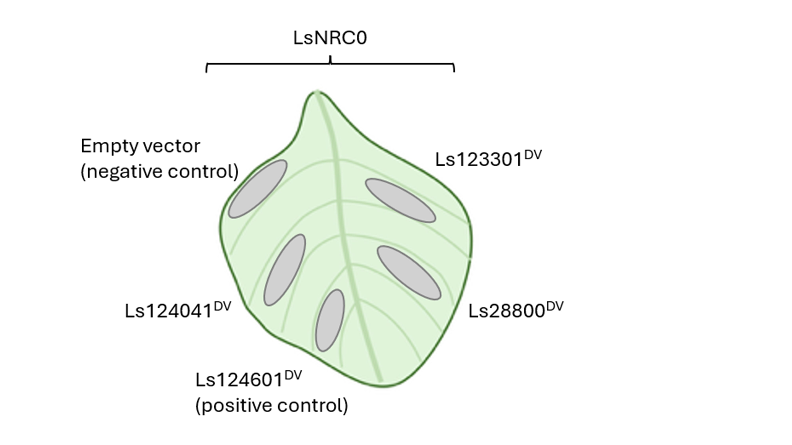
 
In this example, LsNRC0 is coexpressed with empty vector or autoactive sensor LsNLRs such as Ls124041DV. If there is no top level treatment, use a character or string easily identifiable as such in your file name. For example "None" or "-".
On the ImageQuant PC, save images in the S: drive (IFS folder), in your dedicated folder. It is advisable to save all image folders generated for a single experiment in a “parent folder”. Using IFS, transfer this parent folder to your own PC. To avoid issues arising from overly long path names, temporarily saving on Desktop to carry out HR quantification is recommended.

## Stage 1: Selecting channel files for analysis

On your own PC, open ImageJ / Fiji. ImageJ is available to download [here](https://imagej.net/ij/download.html). Use “Plugins > Macros > Run…” to run the macro script `1_Move_image_files.ijm` to move greyscale channel images to a new folder for image processing.
-	The script will first prompt you to navigate to and select the parent folder containing images.

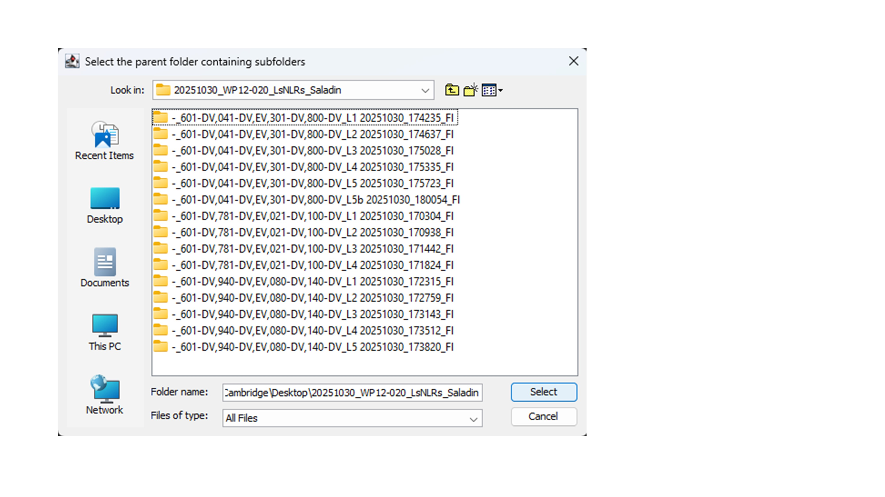

-	Next, the script will prompt the user for the filetype they would like to process. The default (currently best option for highlighting cell death) is the “IRlong” channel. If you would prefer to use an alternative channel, enter the name in the text box (e.g “Cy3” or “UV”).
 
-	This script is hardcoded to generate an output folder within the selected parent folder. This folder will be named based on the channel selected to extract images for, e.g. “IRlong_files”.

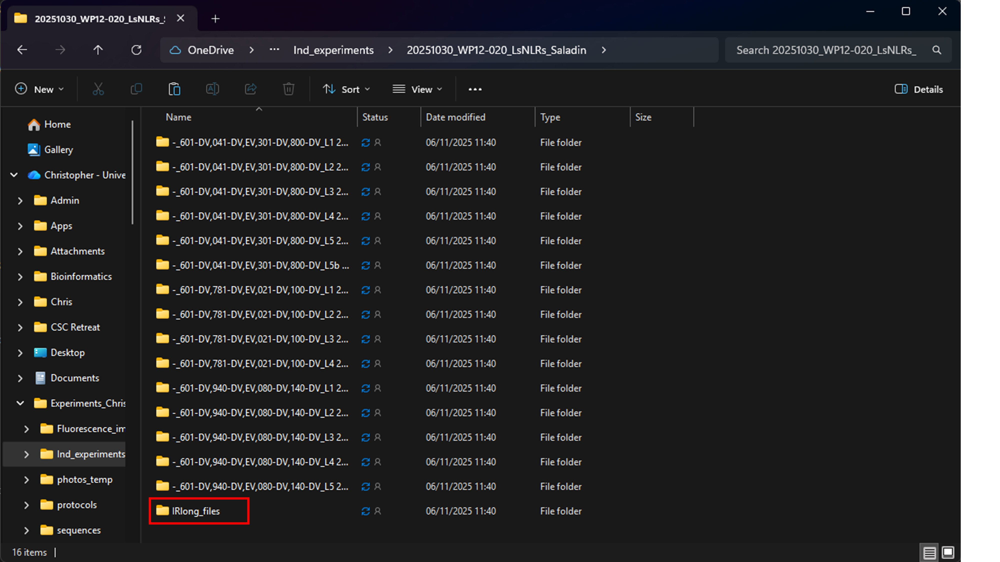
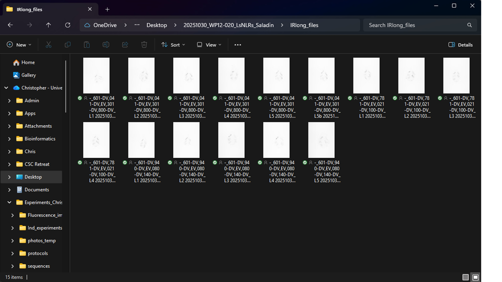 
 
-	This folder should contain all the selected channel files for this experiment. This is important for downstream scripts, which will loop over these files.


### [Optional] Flip images of leaf abaxial sides

If the underside ("abaxial" side) of the leaf has been imaged, these images may be inverted horizontally, to ensure treatment names are correctly matched to leaf patches, using the `1b_Flip_rev_images.ijm` macro script, again using ImageJ.

## Stage 2: Take HR measurements

[](./md_files/HR_scoring.mp4)

_See "md_files/HR_scoring.mp4" for a video illustrating the HR measurement capture process._

[](https://github.com/cstephens0991/Derevnina_Lab_HR_Quantification/blob/main/md_files/HR_scoring.mp4)

Once all the selected channel files have been grouped into a single folder, the ImageJ macro `2_Get_HR_score.ijm` may be run, to collect quantitative HR data.
-	Select the folder containing your images to analyse, e.g. “IRlong_files”

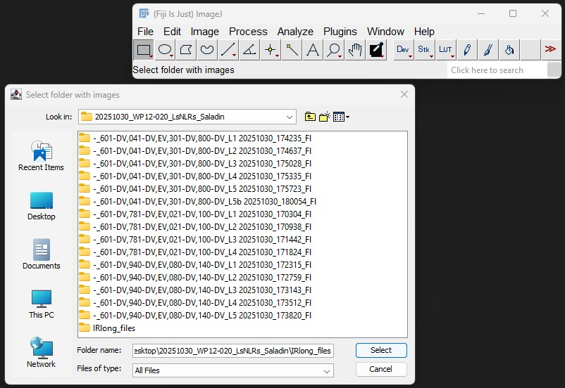 

-	The first image will be opened and a prompt will ask for the number of infiltration patches in the image (e.g. the leaf in the below image has five infiltration patches). Click “OK” to continue.

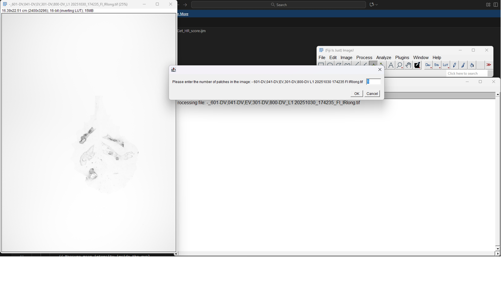  

-	You will also be prompted to select the number of replicate measurements you would like to take for each patch. The default is 3. Press “OK” to continue.

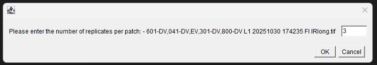  
 
-	Before measuring the infiltration patches, a baseline measurement of the uninfiltrated leaf must be taken. Click on an **uninfiltrated portion** of the leaf and click “OK” to continue. Select three uninfiltrated areas in total, to generate an averaged baseline for uninfiltrated leaf background. 

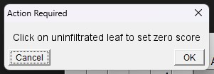  
 
-	The script will now prompt you to measure the first patch. Begin from the **top left** infiltration zone. Click on part of this patch and click “OK” to continue. Repeat this process for this patch `x` times, depending on the number of reps selected above.

 
 
-	Once you have taken the appropriate number of reps for this patch, move on to the second patch. Be sure to measure patches in the same order in which the patches were listed in the file name above.
 


> **_NOTE:_**  If you lose track of how many measurements you have taken, check the “Log” window. This will also display the total number of measurements to take for this image (e.g. 5 patches x 3 reps  = 15 measurements).

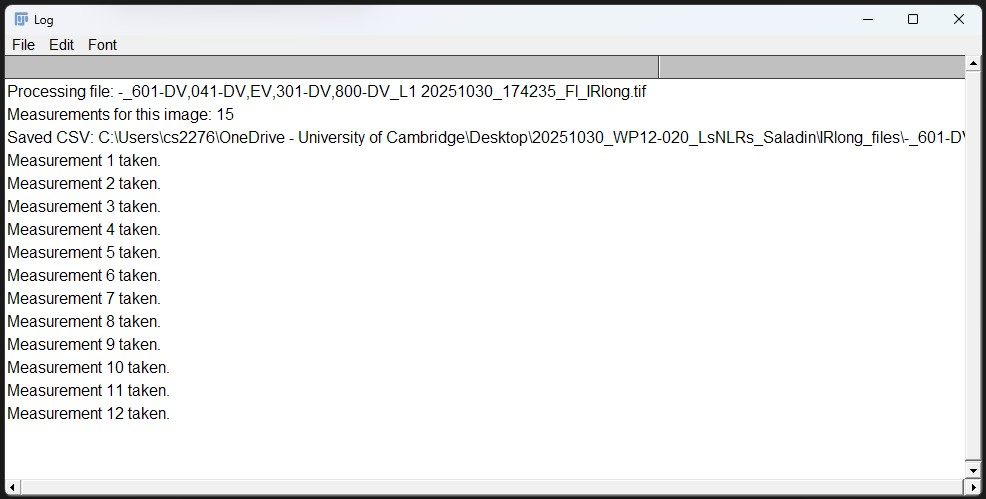 
 
-	Continue taking measurements. Once the final measurement has been recorded. The image will automatically be closed and the next image opened. Again, the user will be prompted for the number of patches in the image and the number of reps.
-	When the measurements have been taken for all images in the folder, the message “All files processed!” will e displayed in the Log.
-	Check the files folder. For each of the selected channel .tif images, there should be two .csv files present: one for the “zero” measurements (background leaf) and another for the patch HR scores.

## Stage 3: Adding treatment data to HR score files

Each of the HR score csv files contains the following data for each zone selected:

- The measurement number
- The mean signal intensity score for the area measured
- The X and Y coordinates for the measurement

To R script `3_Add_treatment_data.R` can be used to add treatment metadata to these dataframes, using the information in the file names. 
Open the file in RStudio. The Source window should display the full script:

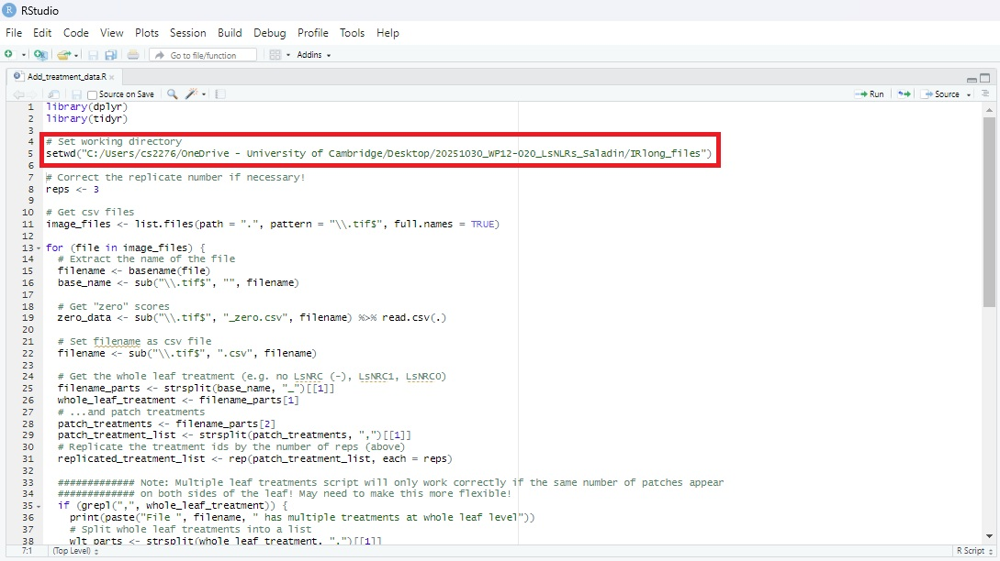 
 
-	Edit the “setwd” command (line 5), to reflect the path to the folder containing the .tif and .csv files generated in stage 2 (above).
-	If necessary, change the number of reps to reflect the number used.
-	Run the script. For each file processed, the Console window should display in the output:
    - Whether the top-level treatment is composed of one or more treatments
    - The averaged "zero" score and name of the output .csv file with the treatment metadata included.

```
"File  -_601-DV,041-DV,EV,301-DV,800-DV_L1 20251030_174235_Fl_IRlong.csv  has single treatment at whole leaf level"
"Average zero score is  1415.13233333333  for  -_601-DV,041-DV,EV,301-DV,800-DV_L1 20251030_174235_Fl_IRlong_ann.csv"
```

-	These “..._ann.csv” files are saved in the image and .csv files destination folder, along with the raw data .csv files and the .tif files.
 
> **_NOTE:_**  When opening the resulting dataframes in Excel, the “Treatment” column is interpreted as a formula. Excel generates the error message “#NAME?”, but the treatment name is unaffected.

## Stage 4: Generate annotated images

In order to confirm that the treatment metadata added to the dataframes is correct, a series of annotated image files can be generated and checked manually to confirm:
•	That measurements were taken in the correct positions, within patches.
•	The treatment metadata associated with those measurements.
To generate annotated images, open ImageJ / Fiji and run the “Annotate_image.ijm” macro.
-	Select the folder containing the files for annotation.
 
-	The script should run automatically, opening files, adding the annotations of measurement location (X and Y axes) and treatment data, saving the annotated image file as “…_ann.tif”, closing the image and opening the next image in the folder.
 

Check through the annotated images, to confirm that the treatment annotations are as expected for each patch.

The annotated dataframes (“…_ann.csv” files) can now be combined and plots of the data generated…
